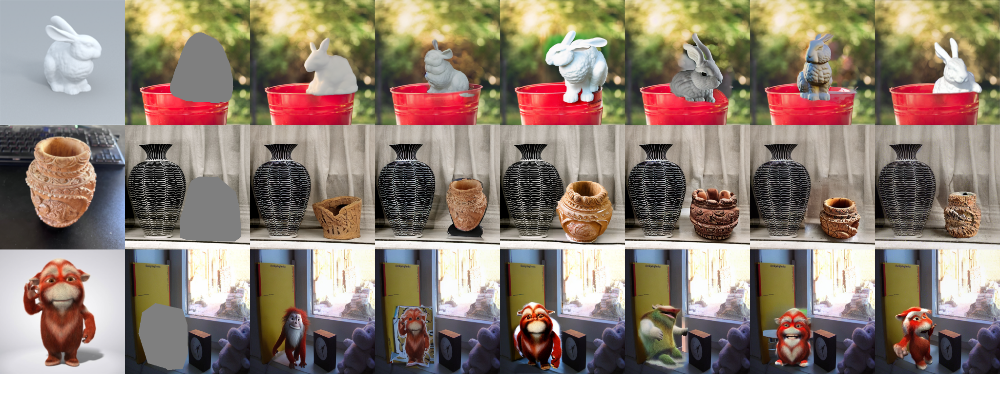

# Inserting Objects into Any Background Images via Implicit Parametric Representation
This repo holds the code for the TVCG paper "Inserting Objects into Any Background Images via Implicit Parametric Representation". [Paper](https://ieeexplore.ieee.org/stamp/stamp.jsp?tp=&arnumber=10753453)

## Abstract
Inserting objects into scenes has wide applications in mixed reality, content generation, and image editing. The objective is to seamlessly integrate objects into background scenes, achieving results comparable to reality. Currently, several methods based on pre-trained diffusion models can effectively insert objects into the scene. However, it is challenging to maintain the consistency of object identities and the harmony between objects and background scenes. In our paper, we introduce a novel representation method for objects, named the implicit parameter representation. Specifically, we focus on a few key parameters for the diffusion model and establish a one-to-one correspondence between these parameters and the target object. In this way, we comprehensively extract and preserve the individualized features of target objects, and the inserted results demonstrate outstanding performance in the consistency of identity and harmony of insertion, especially for virtual objects. Moreover, our proposed method is unrestricted by background scenes, which can insert objects into any background scene. We successfully integrate objects seamlessly into high-resolution image scenes by introducing an insertion method based on the local region. Our proposed method requires a minimal number of object images and computing resources during training. It is based on an end-to-end process, taking only a few seconds during the inference. Furthermore, we constructed a practical dataset named InsertSet for training and testing. It is evident from the extensive experiments that our proposed method has satisfactory performance on object insertion.



## Requirements
```
conda env create -f environment.yaml
```

## Download the Pre-trained Model
We utilize the Paint-by-Example as initialization, please download the pre-trained models from [Hugging Face](https://huggingface.co/Fantasy-Studio/Paint-by-Example/resolve/main/model.ckpt) and save the model to the directory `./checkpoints`.

## Data
We propose a practical dataset for training and testing, named InsertSet, and the training data consists of two parts: few-shot images and same-category images. Please download the training data from (https://pan.baidu.com/s/1jgIFC9opOiRpH6qviPWxXw, extracted code:q49n). For the testing dataset in InsertSet, we manually draw reasonable ROI masks for 1000 background images. These images encompass various background environments, such as indoor, outdoor, real, virtual, and cartoon images, please download the testing data from (https://pan.baidu.com/s/1VKMi5FZMGDES8rBYYmbbUw, extracted code:h80z). Moreover, to enable our method to achieve more diverse object insertions, we provide same-category images comprising 101 common categories and a total of 20,882 data pairs (object images and bounding boxes). Please download the data of same-category images from (https://pan.baidu.com/s/1-EOZJuxU3PmcyGqpuFIX4Q, extracted code:3v6u).

## Training
The configuration file is `./config/v.yaml`, you can set the file path of the training data in --dataset-dir. For real objects, the number of training iterations --max_steps is 4000 and the training module --freeze_model is crossattn-kv. For virtual objects, the number of training iterations --max_steps is 2000 and the training module --freeze_model is crossattn. Then, you run the script train.sh to train the model for objects.
```
sh train.sh
```

## Implicit Parametric Representation
You can run the script get_deltas.sh to obtain implicit parameter representations from the trained parameters. --path is the file path of the model parameters obtained from training. 
```
sh get_deltas.sh
```

## Testing
You can run the script inference.sh to insert the object into any background images. --example_img is the path of the background image for testing.
```
sh inference.sh
```


## Acknowledgements
We thank the contributors of [Paint by Example](https://github.com/Fantasy-Studio/Paint-by-Example) and [Custom Diffusion](https://github.com/adobe-research/custom-diffusion).
